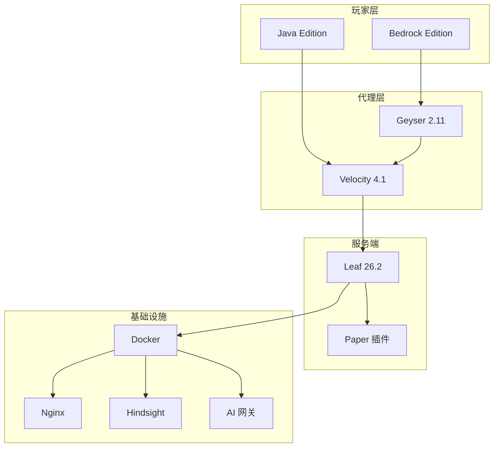

# 服务器状态监控

锐界幻境服务器全维度状态监控，涵盖硬件配置、服务节点、网络连通性与软件架构。

##  ️ 快速连通性检测

实时检测各服务节点是否可达：

<ClientOnly>
  

    

      

         检测结果
        ({{ checkResults.length }}/{{ services.length }} 完成)
      

      <button @click="runQuickCheck" :disabled="isChecking" style="padding: 6px 18px; border-radius: 20px; border: 1px solid var(--vp-c-brand); background: transparent; color: var(--vp-c-brand); cursor: pointer; font-size: 0.85rem; font-weight: 500; transition: all 0.2s;">
        {{ isChecking ? '检测中...' : ' 刷新检测' }}
      </button>
    

    

      

        

          
{{ r.name }}

          
{{ r.label }}

        

        

          

            {{ r.status === 'ok' ? '✅ 连通' : '❌ 超时' }}
          

          
{{ r.ms }}ms

        

      

    

    
 0" style="margin-top: 0.75rem; text-align: right; font-size: 0.8rem; color: var(--vp-c-text-3);">
      {{ checkResults.filter(r => r.status === 'ok').length }}/{{ checkResults.length }} 服务在线
    

  

</ClientOnly>

##  硬件配置

| 配置项 | 规格 |
|--------|------|
| **处理器** | 英特尔 i5 14600KF（5.8GHz 超频） |
| **内存** | 96GB 高频内存 |
| **网络** | **骨干 BGP 200M**（电信/联通/移动三线优化） |
| **存储** | 数据中心级 SSD |

### 网络优势

- **200M 骨干带宽** — 宿迁 BGP 多线接入，全国低延迟
- **三线优化** — 电信/联通/移动用户均可流畅连接
- **骨干线路** — 直连骨干网，减少跳数，更低延迟

##  软件架构

### 核心技术栈

| 组件 | 版本 | 说明 |
|------|------|------|
| **服务端** | Leaf 26.2 | 基于 Pufferfish + Gale，极致性能 |
| **Java** | GraalVM 25 LTS | JIT 编译优化，22% 内存节省 |
| **代理** | Velocity 4.1 | 高性能反向代理 |
| **GC** | G1GC (Aikar) | 优化垃圾回收，减少卡顿 |
| **AI 网关** | New API | 统一 AI 模型管理 |
| **记忆系统** | Hindsight | 跨会话持久记忆 |
| **容器** | Docker + Compose | 全容器化部署 |

### 架构图

### 性能优化

Leaf 服务端启用了多项异步优化：

- **异步区块发送** — 玩家加载区块更流畅
- **DAB 距离 AI** — 远处生物减少计算
- **异步生物生成** — 减少主线程负载
- **异步寻路** — 生物寻路不阻塞主线程
- **虚拟线程** — 节省内存，提升并发

##  节点状态

### 计算/网络节点

<NodeStatus />

> 数据由 ECS 云服务器上的探针程序每 15 秒采集并写入。如节点数据未显示，请确认探针程序运行正常。

### 游戏服务器在线

<iframe frameborder="0" width="100%" height="420" style="max-width:800px; border-radius: 8px;" scrolling="no" src="https://motd.minebbs.com/iframe?ip=dev.miragedge.top&stype=je&dark=true"></iframe>

<iframe frameborder="0" width="100%" height="420" style="max-width:700px; border-radius: 8px;" scrolling="no" src="https://motd.minebbs.com/iframe?ip=dev.miragedge.top&stype=be&dark=true"></iframe>

##  数据备份

| 策略 | 频率 | 说明 |
|------|------|------|
| **数据库备份** | 每日 4 次 | 实时保护游戏数据 |
| **虚拟机克隆** | 每周 | 完整系统快照 |
| **云端归档** | 每月 | 异地容灾保障 |

> 梦始之空世界存档 **永久保存**，我们承诺不会删除任何玩家的心血结晶。

## 相关链接

- [运维待办](/developer/ops/todo)
- [计算资源](/developer/ops/compute)
