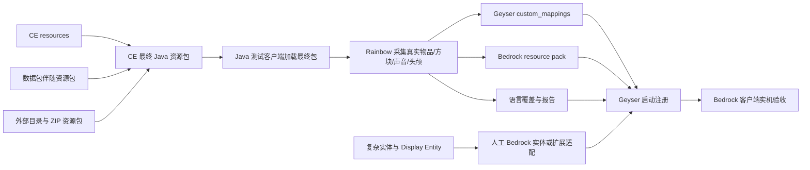

# Geyser 基岩版内容转换工作流 · AI Skills

这是一套面向 MiragEdge 的可执行工作流，不是“把 Java ZIP 改后缀”的教程。目标是把 Java 侧真正送到玩家客户端的最终视觉内容，转换为 Geyser 能注册的映射和基岩版资源包，并留下可重新生成、可回滚、可验收的发布物。

本工作流同时覆盖三类输入：

1. CraftEngine 自己的物品、方块、盔甲、家具、字体与声音资源。
2. 数据包提供逻辑、但随 Java 资源包携带的物品、方块、模型、声音、头颅和展示物。
3. CE 在生成阶段合并的外部资源包，包括模型/生物系统、名称牌、复杂数据包资源包与独立 ZIP。

本文依据 2026-07-31 检索的 Geyser/Rainbow 上游资料和 `F:\FCelestial\CraftEngine\config.yml` 编写。Geyser、Bedrock 协议、Rainbow 和 CE 都会演进；每次升级后都必须重新做版本锁定和实机验收。

## 先给结论

- Geyser **不会**自动把 Java 资源包转换成 Bedrock 资源包；Java ZIP 不能直接放进 Geyser 的 `packs/` 目录。
- 对物品、简单方块、声音、头颅和部分 3D 物品，首选 Rainbow 生成 `custom_mappings`、Bedrock pack 和报告。
- 基岩版行为包或 Add-on 不能替代 Java 服务端逻辑。数据包和 CE 仍运行在 Java 服务端，Bedrock 包只负责客户端视觉与 Geyser 注册结果。
- 复杂生物、CEM/OptiFine/EMF 规则、Display Entity 组合和高级动画不是通用自动转换目标；它们必须进入“手工 Bedrock 实体 + Geyser 扩展”或“第三方 Display Entity 扩展”的独立验收分支。
- 当前 CE 已配置输出未保护副本，且会把外部资源包合并为最终 Java 包。转换器的输入应优先是这个**同一发布批次的未保护最终合并包**，不是单独挑某个 CE pack，也不是受保护的 `resource_pack.zip`。

## 系统边界



这里的关键是“最终 Java 资源包”。CE 的配置可以把目录和 ZIP 合并到一个产物中，Java 客户端看到的是合并后的资源优先级与冲突处理结果。若拿 CE 自建 pack、某个数据包 ZIP 或某个外部模型包分别转换，通常会漏掉覆盖后的模型、纹理、语言、图集或声音。

## 当前 CE 事实基线

以 `F:\FCelestial\CraftEngine\config.yml` 为准，当前转换链路必须认识到以下配置事实：

| 配置事实 | 对基岩转换的含义 |
| --- | --- |
| `resource-pack.path: ./generated/resource_pack.zip` | 这是 Java 玩家实际接收的主产物，但启用了保护/混淆，不应作为转换器首选输入。 |
| `map-plugin-compatibility.enable: true`，路径为 `./generated/resource_pack_map.zip` | 这是给 BlueMap 等地图插件的兼容产物。它不是完整 Java 客户端包，禁止作为 Rainbow 或 Geyser 转换输入；当前 `generated/` 中确实存在此文件。 |
| `protection.unprotected-copy.enable: true`，路径为 `./generated/resource_pack_unprotected.zip` | 配置要求生成同一批次的标准 ZIP，优先作为 Rainbow 的输入。2026-07-31 现场已确认该文件存在；与主包的修改时间相差 241 秒，处于 Bridge 默认 900 秒窗口内。时间接近不证明合并输入完整，仍必须通过 Bridge 审计。 |
| `merge-external-folders` | ModelEngine、EliteMobs 等目录是 CE 的声明输入；当前快照中两个目录缺失，Bridge 会阻断并要求恢复来源或经所有者确认后移除声明，不能静默跳过。 |
| `merge-external-zip-files` | CustomNameplates、BetterModel、D&T、真结局、Sparkles、Stellarity、魅力系统等 ZIP 是 CE 的声明输入；当前 `true-ending`、Sparkles、Stellarity 存在，另外四项缺失，必须逐项核对后再重建最终包。 |
| `client-bound-model: true` | CE 会把客户端模型数据下发到物品栈，Rainbow 应从真实获得的物品读取，而不是仅猜 YAML。 |
| `always-use-item-model: true` 与 `always-use-custom-model-data: true` | 同一物品可能同时具备现代 `minecraft:item_model` 和兼容用 CMD；首选 v2 的 `item_model` 映射，同时保留 legacy 覆盖的审计能力。 |
| `always-generate-model-overrides: true` | 会生成兼容性模型覆盖；这有利于旧式 CMD 识别，但不是“所有模型都可自动转换”的保证。 |
| `block.serverside-blocks: 2000` | CE 方块可能是服务器端真实方块，不能假定它们都是音符盒或其他原版状态覆盖。必须从实际世界和 Geyser/Rainbow 报告确认映射路线。 |

`generate-mod-assets: true` 只说明 CE 还生成供 Java Fabric 客户端工具使用的资源，不会生成任何 Bedrock 资产。CE 的混淆、图集和保护选项也不会自动变成 Bedrock 兼容格式。

## 选择路线

先按最终效果选择路线，再开始转换。不要用“这是一个数据包”或“这是 CE 物品”替代技术分类。

| Java 侧最终效果 | 首选路线 | 自动化边界 | 必须验收 |
| --- | --- | --- | --- |
| 2D 自定义物品 | Rainbow 物品映射 + `item_texture.json` | 通常可自动生成 | 背包、手持、掉落物、容器、配方书 |
| 单纹理 3D 物品 | Rainbow 3D 物品/attachable | 支持简单 Java 模型和部分 display transform | GUI 图标、第一/三人称、头部槽、掉落物 |
| 物品状态切换 | Rainbow 生成 v2 predicate/group | 仅限支持的 broken、damaged、CMD、rod cast、范围/选择条件 | 损坏、蓄力、抛竿、数量和维度切换 |
| 简单盔甲/鞘翅 | Rainbow 读取 `equippable`/装备资源 | 鞘翅仅保证视觉，复杂装备分支需人工检查 | 四个槽位、飞行、第三人称、死亡/重登 |
| 覆盖原版状态的自定义方块 | Rainbow block mapping | 自动扫描可能漏项；可手工标记世界坐标 | 放置、破坏、碰撞、光照、朝向、含水状态 |
| CE 服务器端真实方块 | 先做实测识别，再决定 Geyser 自定义方块 JSON/API | 不承诺 Rainbow 可以覆盖所有注册方式 | 世界同步、交互、区块重载、状态变化 |
| 自定义头颅 | Rainbow `custom-skulls.yml` + Geyser 生成包 | 可导出，但合并不能覆盖已有头颅 | 背包、穿戴、展示框、放置 |
| 自定义声音 | Rainbow sound mapping + Bedrock sound 资源 | 支持资产采集，不保证所有触发语义 | 玩家动作、方块、实体、距离和音量 |
| Java 字体图标、菜单 UI | 单独设计 Bedrock UI/图标回退 | Rainbow 没有承诺通用 Java 字体/UI 转换 | 菜单可读性、点击坐标、文字回退 |
| 原版生物全局换肤 | 手工编写对应 Bedrock 实体资源 | Java 与 Bedrock 实体格式不同 | 所有同类实体是否被错误替换 |
| 条件化自定义生物/CEM/复杂动画 | Geyser Entity API 扩展 + Bedrock 实体包 | API 为实验性；无 JSON 通用映射 | 生成、状态切换、动画、卸载/重载、性能 |
| `item_display`/`block_display` 组合 | 单独评估 GeyserDisplayEntity 或自建扩展 | 官方 Geyser 不原生支持 Display Entity | 可见性、旋转、缩放、跨区块、交互 |

若一个效果横跨多行，例如“数据包 Boss = 实体模型 + 掉落物 + 自定义音乐 + 展示台”，必须拆成多个可验收对象。不要将“Boss 能生成”写成“基岩版兼容”。

## 工作流目录

按以下顺序执行；每页都可以独立交给另一个 AI，但输入、输出和验收记录必须共享同一发布编号。

1. [转换与发布](/developer/workflows/geyser/conversion)：冻结最终 Java 输入、用 Rainbow 采集、审计产物并部署到 Geyser。
2. [CraftEngine 与合并资源包](/developer/workflows/geyser/craftengine)：把 CE YAML、双模型数据、外部合并包和物品收集方法接到转换流水线。
3. [复杂数据包实体与展示](/developer/workflows/geyser/entities)：处理生物模型、Display Entity、ModelEngine/BetterModel 类内容和 Geyser 扩展边界。
4. [验收与排错](/developer/workflows/geyser/validation)：静态审计、Geyser 启动、Bedrock 客户端测试、回滚和故障定位。
5. [协议与产物参考](/developer/workflows/geyser/reference)：查阅 Custom Content、Rainbow、item/block/skull/entity mapping 与 Bedrock pack 的字段边界。
6. [Stellarity 5.5.3 末地批次](/developer/workflows/geyser/stellarity)：按当前服务器真实数据包和 CE 最终包执行 Rainbow 采集、首发合并与后续增量发布。

## 常见陷阱与注意事项

### 1. 武器的 `display_handheld`

基岩版默认所有物品渲染为"手持物品"样式，武器/工具类必须显式设置 `bedrock_options.display_handheld: true`，否则拿在手上像普通物品，没有正确的握持角度。

**受影响的物品类型**：剑、斧、镐、锹、锄、弓、弩、三叉戟、矛、钓竿、盾牌。

```json
{
  "bedrock_identifier": "stellarity:dragonblade",
  "type": "definition",
  "model": "stellarity:dragonblade",
  "bedrock_options": {
    "icon": "stellarity.item_dragonblade",
    "display_handheld": true
  }
}
```

### 2. 盔甲的 `components.minecraft:equippable`

盔甲物品必须设置 `components.minecraft:equippable` 组件，否则基岩版不会在玩家模型上渲染盔甲。该组件需要指定 `slot`（部位）、`asset_id`（纹理标识）、`damage_on_hurt`（是否消耗耐久）和 `equip_sound`（装备音效）。

**slot 映射**：
- 头盔 → `head`
- 胸甲/鞘翅 → `chest`
- 护腿 → `legs`
- 靴子 → `feet`

```json
{
  "bedrock_identifier": "stellarity:champion_chestplate",
  "type": "definition",
  "model": "stellarity:champion_chestplate",
  "components": {
    "minecraft:equippable": {
      "slot": "chest",
      "asset_id": "stellarity:champion",
      "damage_on_hurt": true,
      "equip_sound": "minecraft:item.armor.equip_netherite"
    }
  }
}
```

### 3. 物品图标的 `bedrock_options.icon`

自定义物品必须设置 `bedrock_options.icon` 引用 Bedrock 资源包中的纹理键名，否则基岩版显示默认的 base item 纹理。纹理键名格式为 `namespace.path_with_underscores`，例如 `stellarity.item_dragonblade`。

纹理键名必须与资源包中 `textures/item_texture.json` 的 `texture_data` 键一一对应。

### 4. Base Item 的准确性

**警告**：不要猜测 base item！必须从数据包的 loot table 中提取实际 base item。错误的 base item（如将所有物品设为 `stick`）会导致：
- 物品显示错误的默认纹理
- 盔甲无法正确装备
- 武器没有正确的攻击速度/伤害显示

验证方法：检查数据包中对应的 `loot_table/item/` 下的 JSON 文件，找到 `entries[].name` 字段。

### 5. 状态变体物品（复杂模型）

对于使用 `select`、`condition`、`range_dispatch` 等复杂 item_model 的物品（如弓的拉动状态、弩的装填状态、三叉戟的投掷状态），Geyser v2 映射只能匹配到 item_model 层级，无法处理内部状态变体。

**建议**：映射默认/GUI 纹理即可，状态变体需要在后续通过 Geyser 的 predicate 系统单独处理，或保持现状（基岩版显示默认纹理）。

### 6. 盔甲自定义纹理的限制

Java 版的自定义盔甲纹理（通过 `asset_id` 引用 `assets/<namespace>/textures/entity/equipment/humanoid/` 下的纹理）**不会自动转换到基岩版**。基岩版使用 attachable 系统渲染盔甲纹理，需要额外创建 Bedrock 格式的 attachable 文件。

**当前方案**：映射 `equippable` 组件使盔甲在基岩版上可见，但使用默认的 base item 纹理（如铁盔甲纹理）。要启用自定义纹理，需要：

1. 创建 `attachables/` 目录下的 JSON 文件，定义每个盔甲部位的渲染
2. 将 Java 格式的盔甲纹理转换为 Bedrock UV 贴图格式
3. 放入 `textures/models/armor/` 目录（胸甲用 `_1` 后缀，护腿用 `_2` 后缀）

### 7. Display Entity 支持（光之女皇、自定义方块）

Stellarity 的光之女皇模型和自定义方块使用 Java 的 `item_display`/`block_display` 实体。基岩版原生不支持这些实体类型。

**解决方案**：安装 [GeyserDisplayEntity](https://github.com/GeyserExtensionists/GeyserDisplayEntity) 扩展。

**安装步骤**：
1. 下载 `GeyserDisplayEntity-*.jar` 放入 Geyser 的 `extensions/` 目录
2. 下载 `GeyserDisplayEntityPack.mcpack` 放入 `packs/` 目录
3. 重启 Geyser

该扩展会自动将 item_display 和 block_display 实体转换为基岩版可见的实体。

### 8. 实体生物贴图转换

Stellarity 的末地生物变体贴图（末影猫、末影鸡等）存在于 Java 资源包中，但需要手动转换到基岩版格式。

**工具**：
- [Rainbow](https://geysermc.org/wiki/other/rainbow/) — Geyser 官方 Fabric 转换模组
- [convertmcpack.net](https://convertmcpack.net/) — 在线转换工具
- [mc-tools.net](https://mc-tools.net/pack-converter) — 在线转换工具

**手动步骤**：
1. 将 Java 纹理文件（`assets/stellarity/textures/entity/`）复制到 Bedrock 资源包的 `textures/entity/` 目录
2. 注意 Bedrock 的实体纹理命名规范可能与 Java 不同

### 7. 资源包层级与加载顺序

Geyser 按 `packs/` 目录下的文件顺序加载资源包。多个包之间有同名纹理键时，**后加载的覆盖先加载的**。建议保持命名空间唯一性，避免跨包冲突。

### 8. 映射验证清单

部署前逐项检查：

- [ ] format_version 为 2
- [ ] 所有 bedrock_identifier 唯一，不使用 `minecraft:` 命名空间
- [ ] 武器/工具有 `display_handheld: true`
- [ ] 盔甲有 `components.minecraft:equippable`（含 slot/asset_id/damage_on_hurt/equip_sound）
- [ ] 自定义物品有 `bedrock_options.icon` 引用正确纹理键名
- [ ] base item 从 loot table 验证，非猜测
- [ ] Bedrock 资源包有 `manifest.json` 和 `textures/item_texture.json`
- [ ] 备份当前 mapping 和 pack 后再部署
- [ ] Geyser 重启后验证映射注册日志

## 发布物契约

每个发布批次必须有一个不可变的目录，且至少包含以下项目：

```text
geyser-bridge/releases/<release-id>/
├── input/
│   ├── resource_pack_unprotected.zip
│   ├── source.sha256
│   └── source.sha256
├── rainbow/
│   └── input/                         # 本次新 Rainbow 输出的原始副本
├── custom_mappings/
│   └── miragedge-managed.json
├── packs/
│   └── miragedge-bridge-<release-id>.mcpack
├── locales/
│   └── overrides/
├── custom-skulls.patch.yml
├── merged/
│   └── custom-skulls.yml
├── reports/
│   ├── audit.json
│   ├── java-languages.json
│   ├── rainbow-collection.json
│   └── validation.json
├── coverage.json
└── release.json
```

`custom-skulls.patch.yml` 只保存 Rainbow 本次新增/更新的差异，不能直接复制到 Geyser。`merged/custom-skulls.yml` 才是按四个 section 与服务器现有清单幂等合并后的活动文件。`release.json` 最少记录：CE 生成时间、Java 输入 SHA-256、Geyser build、Rainbow build、Java 测试客户端版本、目标 Bedrock 版本、映射文件名、Bedrock pack SHA-256、已知未覆盖项和实机验收人/时间。不要只保留一个名为 `latest.zip` 的文件；那样既无法回滚，也无法解释某一项为什么消失。

本机已经落地受管实现：`F:\FCelestial\Geyser-Velocity\bridge\bridge.py`。它把当前 `miragedge_*` 映射和包冻结为不可变基线，后续只比较 CE 最终未保护包的文件 SHA、只导入新 Rainbow 输出、只替换明确匹配的映射或 Bedrock 资源项。它不会伪造模型，也不会在 `apply` 前改动 Geyser 活动目录。

当前快照还有一个发布阻断项：CE 配置声明的 `ModelEngine/resource pack`、`EliteMobs/resource_pack`、`CustomNameplates/resourcepack.zip`、`BetterModel/build.zip`、`dnt.zip`、`miragedge-charm-rp.zip` 均不在 `F:\FCelestial` 下。恢复实际来源或依据所有者确认后移除相应配置项，并重新生成 CE 包前，不得把当前 Java 包标记为可复现的可信基线。

## AI 执行契约

任何 AI 接到“让这个 CE/数据包内容支持基岩版”的任务时，必须遵守以下规则。

1. 先读取 `F:\FCelestial\CraftEngine\config.yml` 的资源包、合并、保护和 item 段，再查看本次实际生成的 ZIP、日志与资源路径。
2. 把 CE 自建资源、外部合并包和数据包伴随包统一看作 Java 最终输入的一部分；不得只扫描 `resources/`。
3. 建立内容清单。每个条目至少记录 Java 基础物品、实际 `item_model`/CMD、Java 可见场景、Bedrock identifier、映射状态、异常与验收状态。
4. 通过 Java 测试客户端实际加载最终 Java 包，再让 Rainbow 从真实物品、容器、配方和世界方块采集；不要凭文件名伪造映射。
5. 检查 `report.txt`，将未转换、警告、重复 ID、未知模型和实体问题写入覆盖清单。没有覆盖项不等于转换完整。
6. 只向 Geyser 部署本项目拥有的映射文件、资源包和语言覆盖。`custom-skulls.yml` 必须做结构化合并，禁止整体覆盖。
7. `gameplay.enable-custom-content` 必须为 `true`，并通过重启后的 Geyser 日志确认映射注册。该开关变化需要重启才能生效。
8. 最终结论必须分成“静态通过”“Geyser 启动通过”“Bedrock 实机通过”“尚未覆盖/不支持”四类。没有基岩真机测试时，不得宣称兼容完成。

## 明确禁止

- 将 Java `resource_pack.zip`、数据包 ZIP 或 CE pack 目录直接改名成 `.mcpack` 后投放给 Bedrock 客户端。
- 使用 Bedrock 行为包来补 Java 服务端数据包逻辑；Geyser 的资源包投放不支持该路线。
- 仅用物品名称、Lore、PDC 或配置文件名区分映射。Geyser v2 映射的核心是基础 Java 物品加 `item_model`，或 legacy CMD；这些展示数据不是可靠的通用匹配条件。
- 假定 CE 的 `texture:` 路径就是发给客户端的 `minecraft:item_model` 值。必须从真实物品或 Rainbow 输出确认。
- 把生成的 `custom_mappings` 整个目录无差别覆盖到 Geyser，或把 Rainbow 导出的 `custom-skulls.yml` 覆盖已有服务器清单。
- 依赖 `packs/` 中多个历史 ZIP 的不透明加载顺序。每个项目应只有一个受控的活动 Bedrock 合并包。
- 把 GeyserDisplayEntity 当作所有复杂实体的通用解法。它是社区扩展，解决的是特定 Display Entity 场景。
- 因为 Java 客户端显示正常就跳过 Bedrock 测试。Java 和 Bedrock 的模型、动画、GUI、实体与缓存路径是两条不同链路。

## 参考来源

- [Geyser：Custom Content](https://geysermc.org/wiki/geyser/custom-content)
- [Geyser：Custom Items v2](https://geysermc.org/wiki/geyser/custom-items)
- [Geyser：Custom Blocks](https://geysermc.org/wiki/geyser/custom-blocks)
- [Geyser：Using Resource Packs](https://geysermc.org/wiki/geyser/packs)
- [Geyser：Entity API](https://geysermc.org/wiki/geyser/custom-entities)
- [Geyser：Rainbow](https://geysermc.org/wiki/other/rainbow/)
- [GeyserMC/Rainbow](https://github.com/GeyserMC/Rainbow)
- [GeyserExtensionists/GeyserDisplayEntity](https://github.com/GeyserExtensionists/GeyserDisplayEntity)
- [Kas-tle/java2bedrock.sh](https://github.com/Kas-tle/java2bedrock.sh)：仅作历史背景，已不应作为当前主流程。
